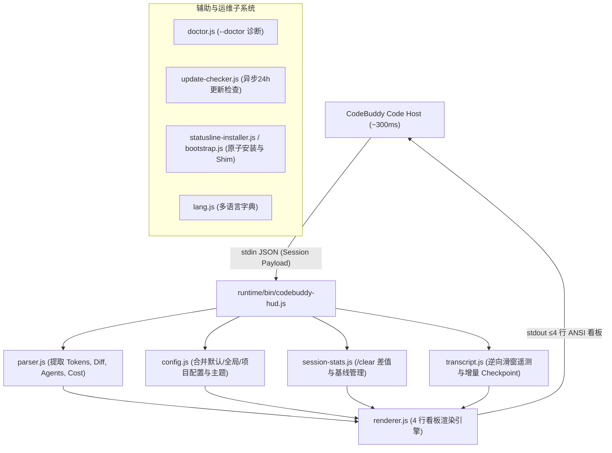

# CodeBuddy HUD 架构设计与核心机制 (Architecture)

本文档系统阐述 `codebuddy-hud` 的核心设计哲学、数据流拓扑、逆向遥测回扫算法与容灾降级机制。

---

## 1. 架构总览与数据流

CodeBuddy Code 宿主以约 $300\text{ms}$ 的高频间隔将当前会话的上下文 JSON 写入 `stdin` 并拉起 HUD。HUD 进程必须在单次超时（$800\text{ms}$ stdin 超时，硬上限 $1500\text{ms}$）内输出 $\le 4$ 行 ANSI 格式的状态看板，并通过事件循环自然排空退出（`process.exitCode = 0`）。

---

## 2. 核心算法与机制解析

### 2.1 逆向 Transcript 滑窗扫描 (Reverse Sliding-Window Telemetry)

- **背景与痛点**：真实 LLM 遥测数据（如 Prompt 缓存命中率 `rawUsage.prompt_cache_hit_tokens`、实际花费 `credits`、最新工具调用）仅存在于会话的 `transcript.jsonl` 中，而宿主传入的 payload 常有字段缺失或瞬时 0 值偏差。
- **算法实现**：
  1. **尾部逆向读取**：从文件 EOF 往前读取固定滑窗（默认 $16\text{KB}$ 至 $256\text{KB}$），避免大文件全量加载占用内存。
  2. **跨块拼装 (Straddle Reconstruction)**：当滑窗边界切断单行 JSONL 时，自动缓存未完成片段，并在上一滑窗拼装还原为完整 JSON。
  3. **Turn 边界截断**：从后向前收集所有 API 调用的 usage，直至遇到 `role: 'user'` 消息时停止，以准确呈现“本轮完整交互的综合命中率与消费”。

### 2.2 `/clear` 会话基线捕获机制 (Session Baseline Tracking)

- **会话识别与重置**：
  - 用户在宿主执行 `/clear` 指令时，token 与 lines added/removed 出现骤降。
  - `session-stats.js` 计算当前指标相对于基线的增量差值。若检测到当前总 token 或行数小于前一快照（单调性打破），立即识别为会话重置，自动建立全新基线并重置耗时统计。

### 2.3 增量 SHA-256 Credits Checkpoint 机制

- **独立持久化**：
  - 对 transcript 文件绝对路径进行 SHA-256 哈希，在 `~/.codebuddy/codebuddy-hud-usage-state/<hash>.json` 记录上次已解析的文件偏移量 `offset` 与累计 `credits`。
- **增量读取**：
  - 下次刷新时仅从 `offset` 处向后扫描新增内容，极大降低磁盘 I/O 消耗（单次增量解析 $< 2\text{ms}$）。
  - 若检测到文件被截断或原地覆写（inode/size 异常），状态机自动判定并无缝回退全量重建。

### 2.4 4 行自适应布局与终端安全契约

- **Line 1 (Identity & Environment)**：模型名称、推理深度（effort）、Git 分支与 Dirty 标记、当前工作区目录名、权限模式、版本与更新角标。
- **Line 2 (Tokens & Context)**：总 Tokens（带 in/out 拆解）、空心/实心进度条、上下文用量百分比、本轮 Cache 命中率。
- **Line 3 (Diff & Credits & Duration)**：代码增删行数（`Δ +X -Y`）、实际 Credits 消费、总耗时与 API 耗时。
- **Line 4 (Agents & Tool Activity)**：活动子代理、队列与完成任务状态，以及当前正在执行/本轮完成的工具调用频次聚合。
- **智能裁剪**：若 Line 3/4 无有效数据自动隐藏，确保输出紧凑且严格 $\le 4$ 行。
- **安全过滤**：所有外部字符串在输出前必须经过 `sanitizeTerminalText()`，剔除 ANSI CSI/OSC 转义序列、C0/C1 控制符以及 Unicode Bidi 欺骗字符。

---

## 3. 跨平台与零依赖设计

1. **绝对零 npm 依赖**：纯基于 Node.js 18+ 原生 API 构建。
2. **Windows 绝对路径 Shim**：生成 `.cmd` 启动脚本时直接烘焙当前安装环境的 `process.execPath` 绝对路径并转义 `%` 为 `%%`，完全免疫 Windows PATH 不一致或 GUI 宿主启动环境变量丢失问题。
3. **无感异步更新检查**：使用 `spawn` + `unref()` 派生独立后台进程，网络 I/O 耗时完全从主渲染链路中剥离，HUD 渲染耗时不受任何网络波动影响。
